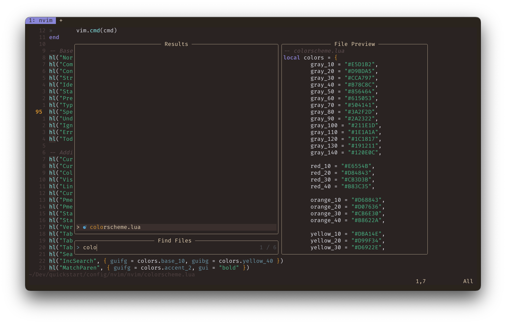

# Primary theme for Neovim

Simple application of the color scheme from the [Primary](https://github.com/primary-theme/obsidian) [Obsidian](https://obsidian.md/) theme to [Neovim](https://neovim.io/).



## Installation

Copy `colorscheme.lua` into your `.config/nvim` directory.

Edit `.config/nvim/init.lua` to set the color scheme :

```
local color_file = ("%s/colorscheme.lua"):format(vim.fn.stdpath("config"))
vim.cmd(("luafile %s"):format(color_file))
```


